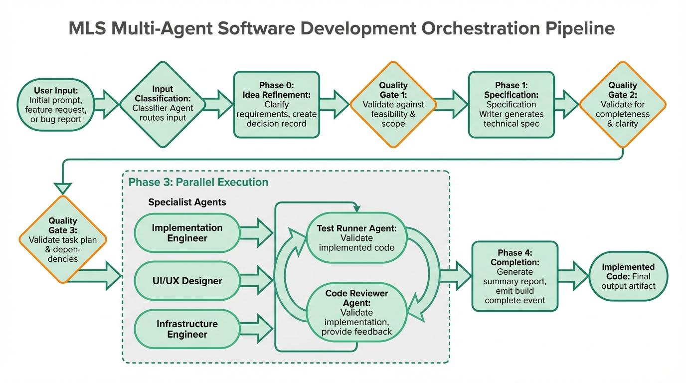

# MLST — Multi-agent Scrum Team

A CLI and MCP server that orchestrates specialist AI agents to build software from ideas through implementation and review.

## How it works

You describe what you want built. MLST classifies your input, then routes it through a pipeline of AI agents:

```
Input → Classifier → Spec Writer → Scrum Master → [Implementation Engineer, Test Runner, Code Reviewer] → Done
```

Each agent has its own system prompt, tools, and model assignment. The pipeline includes quality gates between phases and an implementation → test → review loop that iterates until the code passes.


### Agents

| Agent | Role | Tools |
|---|---|---|
| Specification Writer | Turns ideas into structured specs | read-only |
| Scrum Master | Breaks specs into tasks with dependencies | read-only |
| Implementation Engineer | Writes code | read/write + bash |
| Test Runner | Writes and runs tests | read/write + bash |
| Code Reviewer | Reviews code for issues | read-only |
| UI/UX Designer | Design system decisions | read-only |
| Infrastructure Engineer | Infra and deployment | read/write + bash |

### Input classification

MLST classifies your input and picks the fastest path:

- **bug** — Fast path: implement fix → test → review
- **impl-spec** — Fast path: implement → test → review (skips spec/breakdown)
- **requirements** — Skip idea refinement, go to spec → breakdown → execute
- **feature/epic** — Full pipeline: refine → spec → breakdown → execute → complete
- **plan** — Full pipeline with multi-epic decomposition

## Setup

### Prerequisites

- Node.js >= 20
- A GitHub token with access to [GitHub Models](https://github.com/marketplace/models)

### Install from source

This package is not currently published to a registry — install it from the repo:

```bash
git clone https://github.com/lexicalninja/my-little-scrum-team.git
cd my-little-scrum-team/packages/mlst-app
npm install
npm run build
npm link  # makes `mlst` available globally
```

### Skills

Agent skills are **not** bundled in this package. They live once at the repo
root in `skills/`, shared with the Claude Code plugin, and are resolved at
runtime relative to the installed location. Set `MLST_SKILLS_DIR` to point
somewhere else:

```bash
export MLST_SKILLS_DIR=/path/to/skills
```

If no skills directory is found, agents still run — they just lose their skill
prompts.

### Configure

Set your GitHub token:

```bash
export GITHUB_TOKEN=ghp_your_token_here
```

Or create a project config:

```bash
mlst config init
# Edit .mlst/config.json
```

## Usage

### Option 1: CLI

Run directly in your project directory. Agents read your existing code and write files in place.

```bash
# Simple feature
mlst build "Add a REST endpoint that returns user profiles"

# From a GitHub issue (fetches title + body via the gh CLI)
mlst build '#25'
mlst build --from-issue 25

# Reference an issue in another repo
mlst build 'implement the feature from lexicalninja/my-little-scrum-team#25'

# From a spec file
mlst build --from-file spec.md

# Non-interactive (auto-accept all prompts)
mlst build --yes "Fix the login bug where sessions expire immediately"

# Resume an interrupted build
mlst build --resume abc123

# Check build history
mlst status
```

#### Building from GitHub Issues

MLST can fetch a GitHub issue and use its title and body as the build description. This requires the [GitHub CLI (`gh`)](https://cli.github.com) to be installed and authenticated (`gh auth login`).

| Syntax | Description |
|---|---|
| `mlst build '#25'` | Issue 25 in the current repo (inferred from `git remote origin`) |
| `mlst build --from-issue 25` | Same as above via flag |
| `mlst build 'owner/repo#25'` | Issue 25 in the specified repo |
| `mlst build 'see #25 for context'` | Inline reference — `#25` is expanded in place |

Only the **first** `#N` match in a string is resolved. For cross-repo references the `owner/repo#N` form is matched before bare `#N`.

The resolved input sent to the orchestrator looks like:

```
GitHub Issue #25: <title>

<body>

Labels: bug, enhancement
Milestone: v2.0
```

`Labels:` and `Milestone:` lines are omitted when empty.

See [docs/github-issues.md](./docs/github-issues.md) for the full reference, including prerequisites, error messages, and known limitations.

### Option 2: MCP Server (Claude Code integration)

Run MLST as an MCP server so Claude Code can call it as a tool. No local clone needed — `npx` pulls the package directly from GitHub Packages.

#### Via npx (no local install)

Project-level — add to `.claude/mcp.json` in your project root:

```json
{
  "mcpServers": {
    "mlst": {
      "command": "mlst",
      "args": ["serve"],
      "env": {
        "GITHUB_TOKEN": "ghp_your_token_here"
      }
    }
  }
}
```

Global — add to `~/.claude/mcp.json` (available in all projects):

```json
{
  "mcpServers": {
    "mlst": {
      "command": "mlst",
      "args": ["serve"],
      "env": {
        "GITHUB_TOKEN": "ghp_your_token_here"
      }
    }
  }
}
```

> **Note:** this assumes `mlst` is on your `PATH` via `npm link` (see [Install from source](#install-from-source) above). If it isn't, use the absolute-path form below.

#### Via local path (if installed from source)

```json
{
  "mcpServers": {
    "mlst": {
      "command": "node",
      "args": ["/absolute/path/to/mlst-app/dist/bin/mlst.js", "serve"],
      "env": {
        "GITHUB_TOKEN": "ghp_your_token_here"
      }
    }
  }
}
```

#### MCP Tools exposed

Once connected, Claude Code gets these tools:

| Tool | Description |
|---|---|
| `mlst_build` | Start a new build from a description |
| `mlst_status` | Check status of a build or list recent runs |
| `mlst_resume` | Resume an interrupted build |
| `mlst_list_runs` | List recent build runs |
| `mlst_config` | View current configuration |

#### MCP Resources

Build artifacts are available as MCP resources:

- `mlst://runs/{runId}/status` — Build status and task list
- `mlst://runs/{runId}/specification` — Generated specification
- `mlst://runs/{runId}/tasks` — Task breakdown

### Option 3: Library

```typescript
import { OrchestrationEngine, loadConfig, createGitHubModelsProvider } from '@lexicalninja/mlst';

const config = await loadConfig();
createGitHubModelsProvider({ apiKey: config.api.token });

const engine = new OrchestrationEngine(config, myInteractionHandler);
const result = await engine.build("Add a login page", (event) => {
  console.log(event.type, event);
});
```

## Configuration

Config is loaded from (highest priority first):

1. CLI flags
2. Environment variables (`GITHUB_TOKEN`, `GITHUB_MODELS_BASE_URL`)
3. Project config (`.mlst/config.json`)
4. Global config (`~/.mlst/config.json`)

### Model overrides

Override which model each agent uses in `.mlst/config.json`:

```json
{
  "models": {
    "implementation-engineer": "gpt-4o",
    "code-reviewer": "gpt-4o",
    "test-runner": "gpt-4o-mini",
    "classifier": "gpt-4o-mini"
  },
  "maxSteps": 50,
  "maxReviewIterations": 5
}
```

Available models on GitHub Models: `gpt-4o`, `gpt-4o-mini`, `gpt-4.1`, `gpt-4.1-mini`, `o3`, `o3-mini`, `o4-mini`.

### Defaults

| Role | Default Model |
|---|---|
| classifier | gpt-4o-mini |
| quality-gate | gpt-4o-mini |
| scrum-master | gpt-4o-mini |
| test-runner | gpt-4o-mini |
| ui-ux-designer | gpt-4o-mini |
| specification-writer | gpt-4o |
| implementation-engineer | gpt-4o |
| infrastructure-engineer | gpt-4o |
| code-reviewer | gpt-4o |
| idea-refinement | gpt-4o |

## Publishing

MLST is published to GitHub Packages via a GitHub Actions workflow. To release a new version:

```bash
# 1. Update version in mlst-app/package.json
cd mlst-app
npm version patch  # or minor, major

# 2. Tag and push
git tag "mlst-app/v$(node -p 'require("./package.json").version')"
git push origin --tags
```

The workflow at `.github/workflows/publish-mlst.yml` will automatically:
1. Run tests
2. Build the TypeScript
3. Publish to GitHub Packages

## Development

```bash
npm run build     # Compile TypeScript
npm run dev       # Watch mode
npm test          # Run unit tests
npm run lint      # Type check
```
