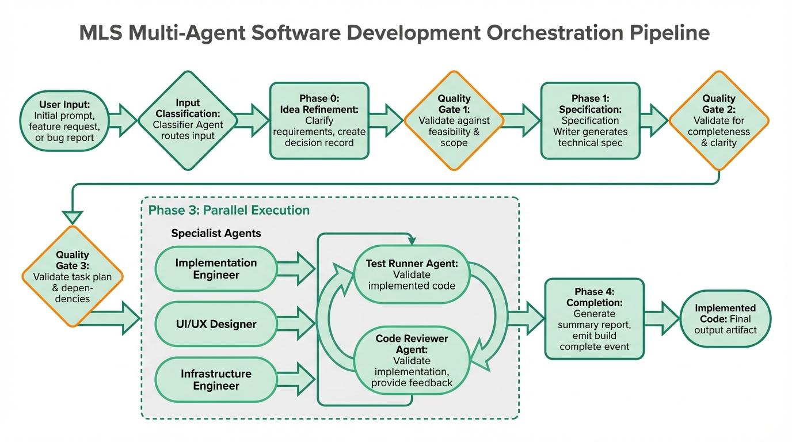

# What is MLST?

My Little Scrum Team (MLST) is a multi-agent orchestration system for [pi.dev](https://pi.dev) that turns a natural language description into a **complete, tested, reviewed feature**.

## One Command Does It All

```bash
/build add user authentication
```

MLST takes this one sentence and:

1. **Clarifies the requirements** — Are they specific enough to proceed?
2. **Writes a detailed specification** — What exactly needs to be built?
3. **Breaks down into tasks** — Which tests to write first? What order?
4. **Implements and tests** — TDD cycle: RED → GREEN → REVIEW
5. **Iterates on feedback** — If code review finds issues, refine and retry
6. **Completes the feature** — Database updated, summary logged

All without leaving pi. No context switching, no manual orchestration.

## How It's Different From Just Using Pi or another coding agent

Pi is a powerful single agent that can read code, write code, run tests, and iterate. But it's **one agent with one context**.

MLST is **seven specialist agents working in parallel**:

| Agent              | Role                                           |
| ------------------ | ---------------------------------------------- |
| **spec-writer**    | Reads codebase, writes detailed specifications |
| **scrum-master**   | Breaks specs into atomic, ordered tasks        |
| **impl-engineer**  | Implements code to make failing tests pass     |
| **code-reviewer**  | Reviews code against acceptance criteria       |
| **designer**       | Creates UI/UX design specifications            |
| **infra-engineer** | Sets up CI/CD, Docker, deployment              |
| **test-runner**    | Writes failing tests (TDD red phase)           |



Each agent is spawned with specific tools and a focused prompt. The orchestrator coordinates them through five phases, picking the cheapest tool type for each decision:

- **[CODE]** — Deterministic TypeScript (fast, no LLM cost)
- **[LLM]** — Direct model call (cheap classification, gate evaluation)
- **[AGENT]** — Full agent subprocess (expensive, but needed for creative work)

## A Real Example

```bash
/build add password reset flow with email verification and rate limiting
```

**Phase 0:** Classify as `feature`, evaluate clarity (OK to proceed)

**Phase 1:** spec-writer produces:

- User flow diagram
- Database schema changes
- Email template
- Rate limit configuration
- Security requirements

**Phase 2:** scrum-master breaks into tasks:

- TASK-001: Update User model with reset_token
- TASK-002: Create email service
- TASK-003: Build reset flow endpoint
- TASK-004: Write integration tests
- ... etc

**Phase 3:** For each task (parallel):

- test-runner writes failing test (RED)
- impl-engineer makes it pass (GREEN)
- code-reviewer checks against acceptance criteria
- Iterate if feedback shows violations

**Phase 4:** Summary and completion

**Result:** A working password reset flow with tests, code review notes, and database migrations — ready to merge.

## What You Get

✅ **Code** — Fully implemented, tested  
✅ **Tests** — Unit and integration tests (RED → GREEN proven)  
✅ **Code Review** — Structured feedback on every piece  
✅ **Database Logs** — Sprint state persisted to local SQLite  
✅ **Run Logs** — Full JSONL event log for auditing  
✅ **Dashboard** — Real-time progress monitor  
✅ **Cost Tracking** — LLM cost per agent, per sprint

## Next Steps

- **[Quick Start](./quick-start.md)** — Install and run your first build
- **[Input Formats](./input-formats.md)** — Learn how to describe your feature
- **[Configuration](./configuration.md)** — Set up models and providers